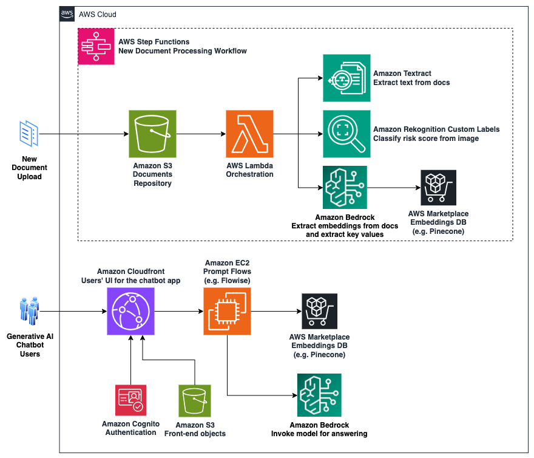

# Financial Documents Insights with Generative AI

In this sample, we show a solution for having an interactive and multi-lingual chatbot on financial documents' data, powered by Amazon Bedrock and other AWS services.

### Examples

#### Interaction for questions on a specific ID

#### Interaction for aggregation questions across all IDs

#### Risk score classification from documents' images

### Solution Overview

For this example, we're working with 50 documents in 17 languages from Allfunds, each one containing a financial analysis for a specific fund, identified with an ID called 'ISIN'.

We implement a Retrieval Augmented Generation (RAG) flow from the indexed documents, and combine this knowledge with a Large Language Model (LLM) through a retriever artefact.

#### Architecture Diagram

#### Sample Flows

For this example, we're using AWS Step Functions for orchestrating the logic each time we upload a new document. Also, for the generative AI interaction, we're using Flowise through its integration with Amazon Bedrock; note however, in the future it's also possible to implement the generative AI flows with Bedrock Prompt Flows directly.

**New document processing flow**

**Single document indexing and upsert into embeddings**

**Documents retrieval in RAG & aggregation flows**

