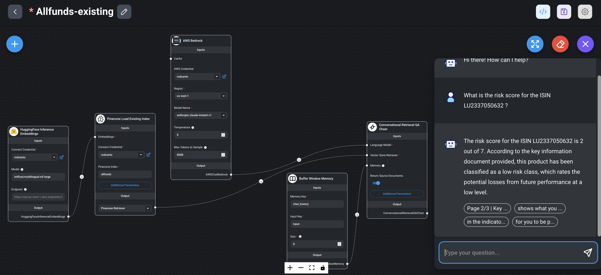

# Financial Documents Insights with Generative AI

In this sample, we show a solution for having an interactive and multi-lingual chatbot on financial documents' data, powered by Amazon Bedrock and other AWS services.

### Solution Overview

For this example, we're working with 50 documents in 17 languages from Allfunds, each one containing a financial analysis for a specific fund, identified with an ID called 'ISIN'.

We implement a Retrieval Augmented Generation (RAG) flow from the indexed documents, and combine this knowledge with a Large Language Model (LLM) through a retriever artefact.

### Examples

#### Interaction for questions on a specific ID

Based on the company documents, with Amazon Bedrock we can ask any questions about these specific funds and their financial indicators.

In this demo we show the option of having an AI Assistant as a pop-up chat in any webpage.

https://github.com/rodzanto/financial-documents-insights/assets/42835728/6dc9809f-a3e6-4165-8a3a-71f8a9261f1b

#### Interaction for aggregation questions across all IDs

By defining prompt flows for Amazon Bedrock, it is also possible to ask questions that require aggregations or queries across the documents available.

In this demo we show the option of having a full page for the AI Assistant interaction.

https://github.com/rodzanto/financial-documents-insights/assets/42835728/752a90cc-2b0b-4f75-b486-ce220408c942

#### Risk score classification from documents' images

With Amazon Rekognition, we can also verify the risk scores based on the image scale provided in the documents. This is a mechanism for ensuring this risk level is considered over any other indication in the documents' text. If this case we're using Custom Labels, a feature that let us label and use our own documents, and takes care of the AutoML for having a high-quality model available for our use case.

For this demo, we labeled 38 documents through the interactive UI of Amazon Rekognition Custom Labels, and kept 12 images for testing. In the demo we explore different documents, some of them having missing risk values in the text, or even having a different value in the text, for checking if the image' score prevails as expected.

https://github.com/rodzanto/financial-documents-insights/assets/42835728/767e4fa1-cd35-4f0c-936f-c9ce4b13e61a

#### Architecture Diagram

The proposed architecture in AWS for the solution demonstrated is as follows.

#### Sample Flows

For this example, we're using AWS Step Functions for orchestrating the logic each time we upload a new document. Also, for the generative AI interaction, we're using Flowise through its integration with Amazon Bedrock; note however, in the future it's also possible to implement the generative AI flows with Bedrock Prompt Flows directly.

**New document processing flow**

**Single document indexing and upsert into embeddings**

**Documents retrieval in RAG & aggregation flows**

